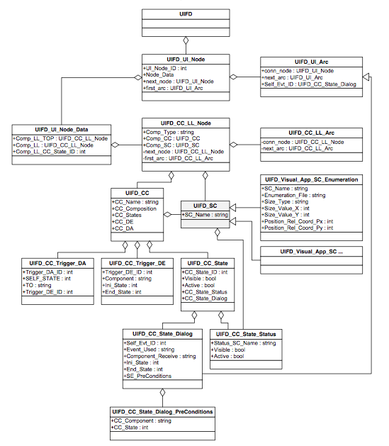
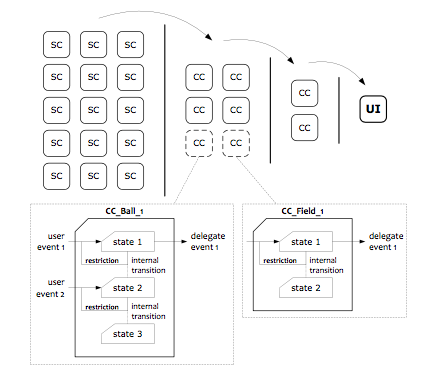

# FreeDesignUI - IDE.

## System Definition ...




### Simple-Component ...

#### Definition :

```xml
<Simple-Component Name="name" Visible="true" Active="true">
	<Visual-Appearance>
    	<Enumeration>
      		<File>file.png</File>
      		<Size Type="fixed">
        		<ValueX>70</ValueX>
        		<ValueY>70</ValueY>
      		</Size>
          	<!-- Lib -->
      		<Position>
        		<Relative>
          			<Coordinate>
            			<Px>50</Px>
            			<Py>35</Py>
          			</Coordinate>
        		</Relative>
      		</Position>
			<!-- / Lib -->
    	</Enumeration>
	</Visual-Appearance>
</Simple-Component>
```


### Complex-Component ...

#### Structure :



#### Definition :

```xml
<Complex-Component Name="name">
	<Composition>
      	<SC>SC-Field-1-N</SC>
   		<SC>SC-Field-1-C</SC>
  	</Composition>
  	<CC_States>
    	<CC_State ID="0" Visible="true" Active="true">
      		<Status>
        		<SC Name="SC-Field-1-N" Visible="true" Active="true" />
        		<SC Name="SC-Field-1-C" Visible="false" Active="false" />
      		</Status>
      		<Dialog_State>
				<Self_Evt ID="1" Event="<!-- Lib -->" Component="SC-Field-1-N" Ini_State="0" End_State="1" />
				<Preconditions>
					<Pre_Cond Component="<!-- Lib -->" State="<!-- Lib -->" />
      			</Preconditions>
      		</Dialog_State>
		</CC_State>
	</CC_States>
	<External_Events>
			<Delegate_Events>
				<Trigger_DE ID="1" Component="<!-- Lib -->" Ini_State="1" End_State="2" />
      		</Delegate_Events>
      		<Delegate_Actions>
				<Trigger_DA ID="1" SELF_STATE="1" TO="<!-- Lib -->" Trigger_DE_ID="2"/>
              	<Trigger_DA ID="2" SELF_STATE="1" TO="<!-- Lib -->" Trigger_DE_ID="2"/>
    		</Delegate_Actions>
	</External_Events>
</Complex_Component>
```
